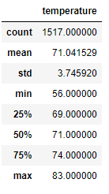

# surfs_up

## Overview of the analysis

For this challenge, we are analyzing temperature trends in Oahu. To convince W. Avy to invest in our Surf shop, he has asked us to provide temperature data for the months of June and December in Oahu, in order to determine if the surf and ice cream shop business is sustainable year-round.

 

## Results 

* In June, the average temperature is 74.9 F, the lowest temperature is 64 F and max temperature is 85 F. 
* In December, the average temperature is 71.04 F, the lowest temperature is 56 F and max temperature is 83 F. 
* Temperatures in December are lower than June. However, there is not a huge difference. 

## Summary 

* The average temperatures for the months of June and December are 74.9 and 71.04 respectively. From this, we can say that weather is fairly consistent. 
* I would perform additional queries on precipitation and wind since these are two important factors when considering going surfing.
